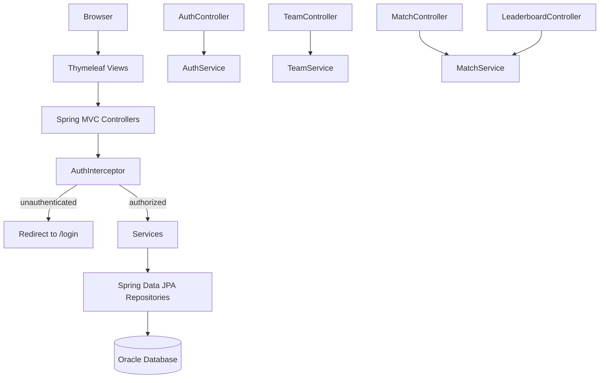
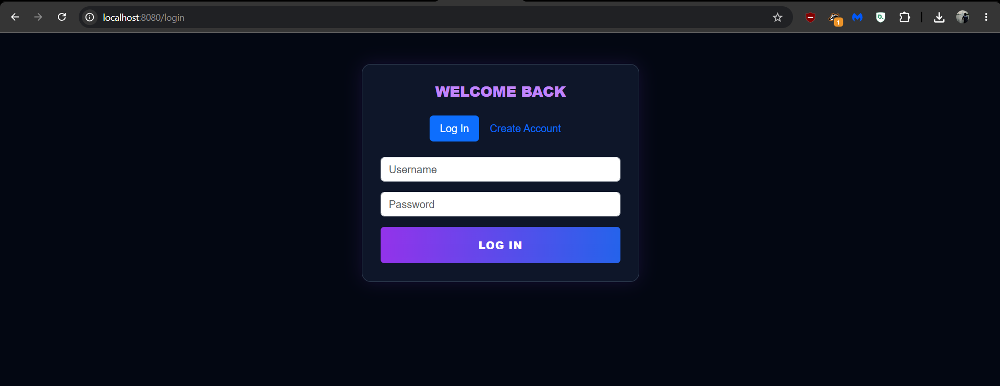
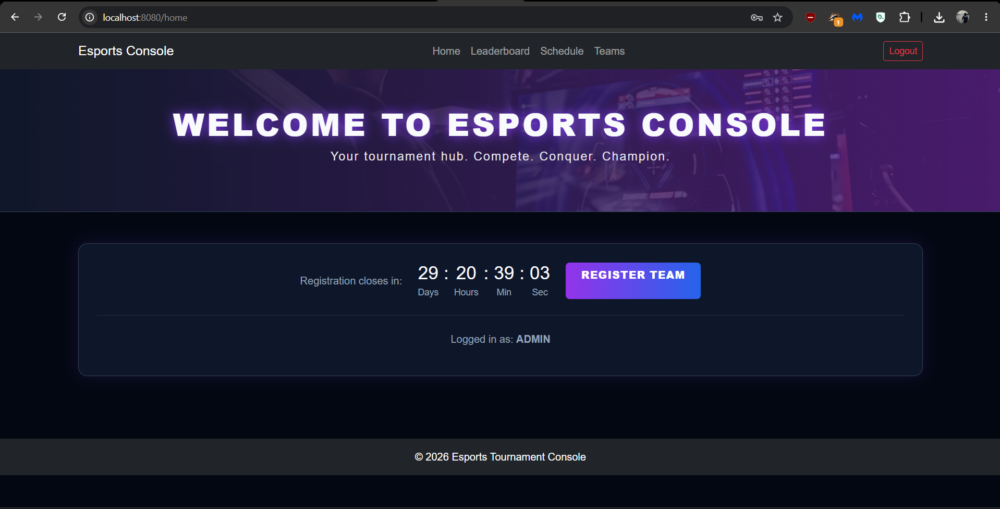
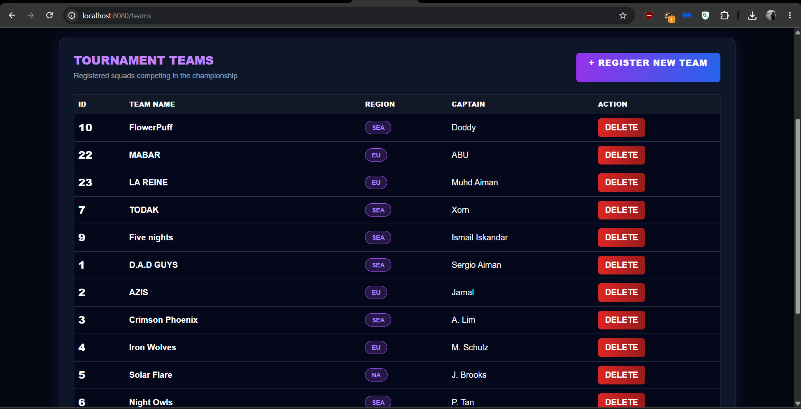
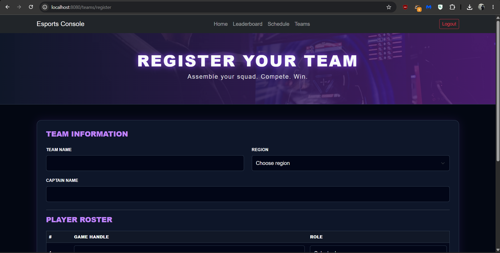
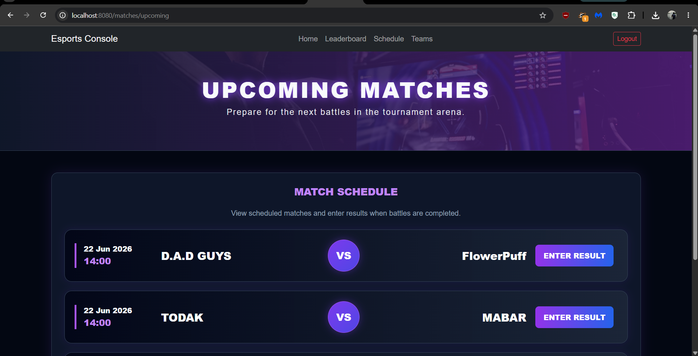
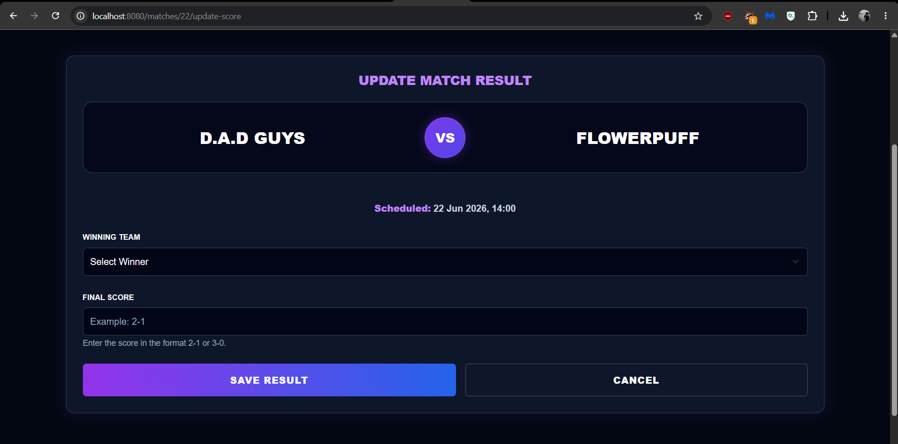
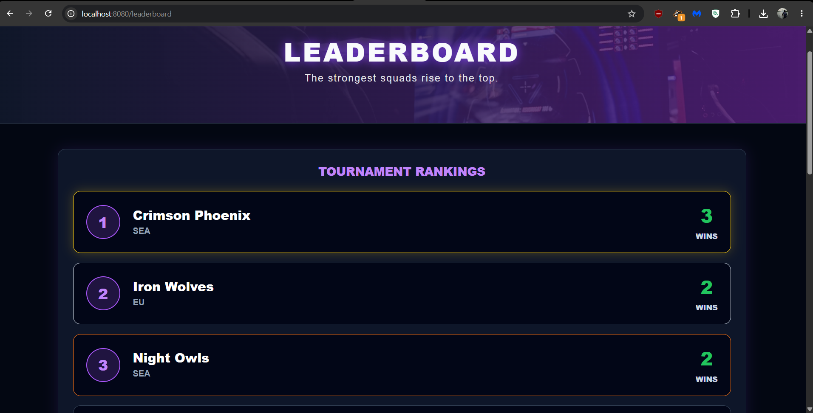

# Esport Tournament Console

A web-based esports tournament management system built with **Spring Boot**, **Thymeleaf**, and **Oracle Database**, developed for the CCS3402 group project. It supports team registration, match scheduling, score updates, and a live leaderboard, with role-based access for **Admins** and **Players**.


---

## Table of Contents

- [Project Overview](#project-overview)
- [Core Features](#core-features)
- [Tech Stack](#tech-stack)
- [Architecture](#architecture)
- [Project Structure](#project-structure)
- [Database Schema](#database-schema)
- [Getting Started](#getting-started)
- [Configuration](#configuration)
- [Running the Application](#running-the-application)
- [Application Routes](#application-routes)
- [Roles and Access Control](#roles-and-access-control)
- [Security Notes](#security-notes)
- [Screenshots](#screenshots)
- [Team](#team)

## Project Overview

Esport Tournament Console is a CRUD-driven console for managing a small esports tournament end-to-end:

- Teams register with a roster of players
- Matches are scheduled between teams
- Admins record match results and winners
- A leaderboard automatically ranks teams by wins

The app uses server-rendered Thymeleaf views with session-based authentication, so no separate frontend build step is required.

## Core Features

| Feature | Description |
| --- | --- |
| **User Authentication** | Username/password login and registration, with passwords hashed using BCrypt. |
| **Role-Based Access** | `ADMIN` and `PLAYER` roles, enforced server-side via a request interceptor. |
| **Team Registration** | Register a team with a name, region, captain, and an initial roster of players. |
| **Roster Management** | Players are linked to teams via a one-to-many relationship with cascade delete. |
| **Match Scheduling** | View upcoming matches between two teams. |
| **Score Updates** | Record the winning team and final score for a match. |
| **Leaderboard** | Aggregates win counts per team and ranks them automatically. |
| **Team Deletion (cascade)** | Admins can remove a team and its linked roster, with a confirmation step that surfaces linked matches. |

## Tech Stack

| Layer | Technology |
| --- | --- |
| Language | Java 17 |
| Framework | Spring Boot 3.2 (Web, Data JPA, Validation) |
| View layer | Thymeleaf |
| Database | Oracle (via `ojdbc11`) |
| ORM | Hibernate / Spring Data JPA |
| Security | Spring Security Crypto (BCrypt password hashing) |
| Auth mechanism | HTTP session (`HttpSession`), custom `HandlerInterceptor` for route guarding |
| Build tool | Maven |

## Architecture



### Main Components

- **Controllers** (`controller/`) — `AuthController`, `HomeController`, `TeamController`, `MatchController`, `LeaderboardController` handle HTTP routing and form submission.
- **Services** (`service/`) — `AuthService`, `TeamService`, `MatchService` contain business logic (login validation, cascade deletes, leaderboard aggregation, score updates).
- **Repositories** (`repository/`) — Spring Data JPA interfaces for `User`, `Team`, `Player`, and `Match` entities.
- **Models** (`model/`) — JPA entities: `User`, `Role` (enum: `ADMIN`, `PLAYER`), `Team`, `Player`, `Match`.
- **Config** (`config/`) — `AuthInterceptor` enforces login and admin-only routes; `WebMvcConfig` registers the interceptor.
- **Views** (`resources/templates/`) — Thymeleaf templates for login, home, team registration/listing/deletion, match schedule, score updates, and the leaderboard.

## Project Structure

```
Esport-Tournament-Console/
├── pom.xml
├── README.md
└── src/main/
    ├── java/com/esports/tournamentconsole/
    │   ├── TournamentConsoleApplication.java
    │   ├── config/
    │   │   ├── AuthInterceptor.java
    │   │   └── WebMvcConfig.java
    │   ├── controller/
    │   │   ├── AuthController.java
    │   │   ├── HomeController.java
    │   │   ├── LeaderboardController.java
    │   │   ├── MatchController.java
    │   │   └── TeamController.java
    │   ├── model/
    │   │   ├── Match.java
    │   │   ├── Player.java
    │   │   ├── Role.java
    │   │   ├── Team.java
    │   │   └── User.java
    │   ├── repository/
    │   │   ├── MatchRepository.java
    │   │   ├── PlayerRepository.java
    │   │   ├── TeamRepository.java
    │   │   └── UserRepository.java
    │   └── service/
    │       ├── AuthService.java
    │       ├── MatchService.java
    │       └── TeamService.java
    └── resources/
        ├── application.properties
        ├── static/css/style.css
        └── templates/
            ├── delete-team.html
            ├── home.html
            ├── leaderboard.html
            ├── login.html
            ├── register-team.html
            ├── schedule.html
            ├── teams-list.html
            ├── update-score.html
            └── fragments/
                ├── footer.html
                └── nav.html
```

## Database Schema

The app expects the following tables to already exist in Oracle (`spring.jpa.hibernate.ddl-auto=validate`, so Hibernate checks the schema rather than creating it):

| Table | Key Columns |
| --- | --- |
| `app_user` | `id`, `username`, `passwordHash`, `role` |
| `TEAMS` | `TEAM_ID`, `TEAM_NAME` (unique), `REGION`, `CAPTAIN_NAME` |
| `PLAYERS` | `PLAYER_ID`, `TEAM_ID` (FK), `GAME_HANDLE`, `IN_GAME_ROLE` |
| `MATCHES` | `MATCH_ID`, `TEAM1_ID` (FK), `TEAM2_ID` (FK), `SCHEDULED_TIME`, `WINNER_TEAM_ID` (FK, nullable), `SCORE` |

## Getting Started

### Prerequisites

- Java 17 (JDK)
- Maven 3.8+
- Access to an Oracle database instance
- An IDE such as IntelliJ IDEA (optional, project includes `.idea` config)

### Clone and Build

```bash
git clone <your-repo-url>
cd Esport-Tournament-Console
mvn clean install
```

## Configuration

Database and server settings live in `src/main/resources/application.properties`:

```properties
spring.application.name=tournament-console

# Hibernate
spring.jpa.database-platform=org.hibernate.dialect.OracleDialect
spring.jpa.hibernate.ddl-auto=validate
spring.jpa.show-sql=true
spring.jpa.properties.hibernate.format_sql=true

# Thymeleaf (disable cache during development)
spring.thymeleaf.cache=false

server.port=8080
```

## Running the Application

```bash
mvn spring-boot:run
```

Or run the packaged jar:

```bash
mvn clean package
java -jar target/tournament-console-0.0.1-SNAPSHOT.jar
```

The app starts on:

```
http://localhost:8080
```

Visiting `/` redirects to `/home`, which in turn redirects unauthenticated users to `/login`.

## Application Routes

| Method | Route | Description | Access |
| --- | --- | --- | --- |
| GET | `/login` | Login page | Public |
| POST | `/login` | Authenticate user | Public |
| GET | `/logout` | Invalidate session | Logged in |
| GET | `/register-account` | Registration page | Public |
| POST | `/register-account` | Create a new `PLAYER` account | Public |
| GET | `/home` | Landing page after login | Logged in |
| GET | `/teams` | List all teams | Admin only |
| GET | `/teams/register` | Show team registration form | Logged in |
| POST | `/teams/register` | Register a team + roster | Logged in |
| GET | `/teams/{id}/delete` | Confirm team deletion | Admin only |
| POST | `/teams/{id}/delete` | Delete team (cascade) | Admin only |
| GET | `/matches/upcoming` | View match schedule | Logged in |
| GET | `/matches/{id}/update-score` | Show score update form | Logged in |
| POST | `/matches/{id}/update-score` | Submit match result | Logged in |
| GET | `/leaderboard` | View ranked leaderboard | Logged in |

## Roles and Access Control

The app defines two roles via the `Role` enum: `ADMIN` and `PLAYER`.

- New self-registrations are always created as `PLAYER`.
- `AuthInterceptor` checks every request: unauthenticated users are redirected to `/login`, and non-admins attempting to access `/teams` (list) or `/teams/{id}/delete` are redirected to `/home`.
- Team registration itself is open to any logged-in user; only the team **list** and **delete** routes are admin-restricted.

## Security Notes

A few things worth addressing before sharing or deploying this project publicly:

- **Credentials in `application.properties`:** the current file contains a real database username/password. Rotate these credentials and move them out of version control (environment variables, a local-only properties file, or a secrets manager).
- **Password storage:** user passwords are hashed with BCrypt (`spring-security-crypto`), which is good practice — but the app does not use full Spring Security (no CSRF protection, no login throttling). Treat this as an academic prototype rather than a production-ready auth system.
- **Session-based auth:** login state is stored in `HttpSession` rather than a token, so the app currently has no "remember me" or multi-device session handling.

## Screenshots


| Login Page | Home |
| --- | --- |
|  |  |

| Teams List | Register Team |
| --- | --- |
|  |  |

| Match Schedule | Update Score |
| --- | --- |
|  |  |

| Leaderboard |
| --- |
|  |

## Team

| Name | Role | Contact / GitHub |
| --- | --- | --- |
| ISMAIL BIN BAKHTIAR | Backend / DB
Lead | joiboi56 |
|TENGKU EYMRAN
RADHI PUTRA BIN
TENGKU RINALFI
PUTRA | Frontend / UI
Lead | _Add GitHub_ |
| LOQMANNUL HAQIM
BIN MOHAMAD | MVC / CRUD
Lead | _Add GitHub_ |
| MUHAMMAD AIMAN
HAFIY BIN MOHD
NIZAM
 | Integration / Git /
Testing Lead | _Add GitHub_ |


---

*Esport Tournament Console — CCS3402 Group Project.*
